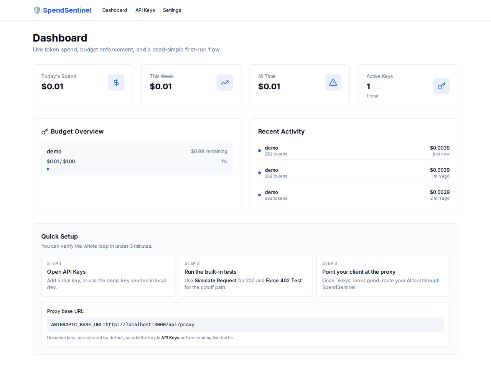

# 🛡️ SpendSentinel

> local-first token cost firewall for AI agent workflows.

Stop surprise API bills with per-key budgets, live usage tracking, warning alerts, and hard cutoff before spend runs away.

---

## Demo



What the demo shows:
- open `/keys`
- run **Simulate Request** to confirm the happy path
- run **Force 402 Test** to confirm budget cutoff works
- jump back to the dashboard to see tracked spend

---

## Why SpendSentinel

- Track token spend per API key
- Set monthly budgets per key
- Enforce budget cutoffs before request execution
- View live dashboard totals (today/week/all-time)
- Manage keys (add, disable, delete, update budget)
- Send threshold alerts to Discord/Slack webhooks
- Verify local setup from the UI without touching curl

---

## 3-Minute First Run

```bash
npm install
cp .env.example .env.local
npm run dev
```

Open:
- Dashboard: `http://localhost:3000`
- Keys: `http://localhost:3000/keys`
- Settings: `http://localhost:3000/settings`

Then do this:
1. Open **API Keys**
2. Use the seeded demo key in local dev, or add your own
3. Click **Simulate Request** → should return `Status 200`
4. Lower the key budget, then click **Force 402 Test** → should return `Status 402`
5. Open **Dashboard** to confirm spend tracking is updating

That gives you a full happy-path + cutoff-path smoke test without leaving the UI.

---

## Point Your Client At The Proxy

```bash
export ANTHROPIC_BASE_URL=http://localhost:3000/api/proxy
```

Then send requests through `/api/proxy` using a key already added in `/keys`.

> API keys must be sent via `x-api-key` header only, not in the request body.

### Example request

```bash
curl -X POST http://localhost:3000/api/proxy \
  -H "Content-Type: application/json" \
  -H "x-api-key: sk-ant-your-key" \
  -d '{
    "model": "claude-3-5-sonnet-20241022",
    "messages": [{"role":"user","content":"hello"}],
    "max_tokens": 256
  }'
```

---

## Screenshots

### Dashboard


### Keys


### Settings


---

## API Endpoints

### Keys
- `GET /api/keys` → list tracked keys (masked)
- `POST /api/keys` → add key `{ name, key, budget }`
- `PATCH /api/keys` → update `{ id, enabled?, budget? }`
- `DELETE /api/keys?id=<id>` → delete key
- `POST /api/keys/test` → trigger a local UI/dev smoke request for a saved key

### Proxy
- `POST /api/proxy` → enforce budget + forward (or demo response)
- `GET /api/proxy` → dashboard totals + recent usage
- `DELETE /api/proxy` → clear recent activity logs

### Settings
- `GET /api/settings` → fetch alert + cutoff settings
- `PUT /api/settings` → persist alert + cutoff settings
- `POST /api/settings/test` → send test webhook notification

---

## Demo Mode vs Live Forwarding

By default:
- `SPEND_SENTINEL_DEMO_MODE=true`
- `/api/proxy` returns a simulated assistant response and still tracks spend

For live forwarding:
1. Set `SPEND_SENTINEL_DEMO_MODE=false` in `.env.local`
2. Use real Anthropic keys in `/keys`
3. SpendSentinel forwards calls to `https://api.anthropic.com/v1/messages`

---

## Security Notes

- Supports optional HTTP Basic Auth gate for dashboard + API
- Refuses to run unauthenticated in production mode
- Uses header-only key ingestion (`x-api-key`) to reduce accidental payload leaks
- Demo-key auto-seeding is dev/demo-only and can be disabled
- This repo is intentionally local-first and operator-focused

---

## License

MIT. Do whatever you want with this.

## About

Made by [@BChopLXXXII](https://x.com/BChopLXXXII)

Built for vibe coders who want compounding speed without cost chaos.

Ship it. 🚀

---

If this helped, [star the repo](https://github.com/BChopLXXXII/spend-sentinel) — it helps others find it.
